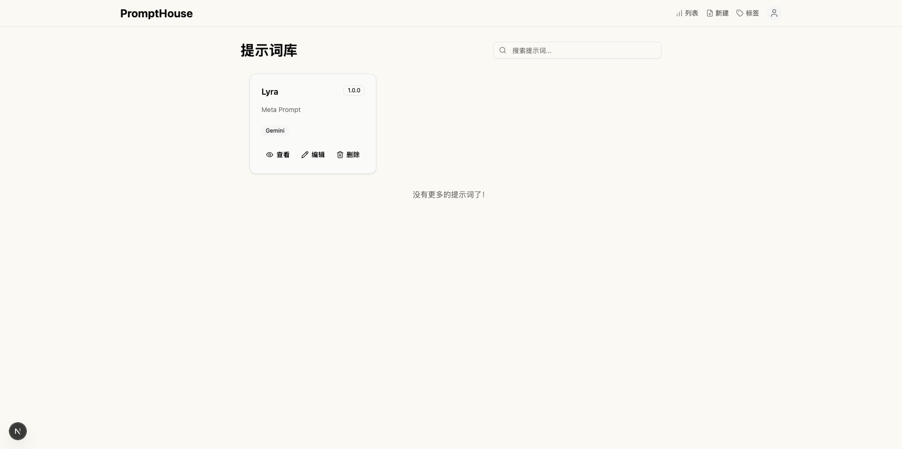
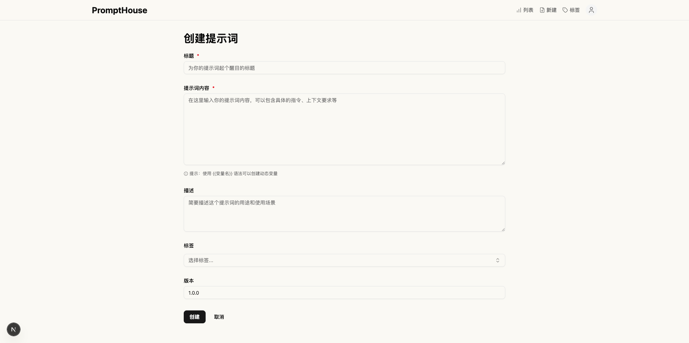

<div align="center">
    
    
</div>

<p align="center">
    <em>PromptHouse - 一个现代化的提示词资产管理平台，它提供了直观的界面来创建、组织和分享提示词，帮助用户更好地管理和利用他们的 AI 提示词资产。</em>
</p>

---

## ✨ 特性

- 🎯 **提示词管理**: 创建、编辑和版本化你的提示词
- 🏷️ **标签系统**: 使用标签对提示词进行分类和组织
- 📱 **响应式设计**: 完美适配桌面和移动设备
- 🎨 **现代化 UI**: 基于 Radix UI 和 Tailwind CSS 的美观界面
- ⚡ **高性能**: 使用 Next.js 15 和 Turbopack 构建
- 🗄️ **数据持久化**: 使用 PostgreSQL 数据库存储数据

---

## 🚀 快速开始

### 前置要求

- Node.js 18+
- PostgreSQL 数据库
- Docker (可选，用于本地数据库)

### 本地开发

1. **克隆项目**

   ```bash
   git clone https://github.com/amazingchow/PromptHouse.git
   cd PromptHouse
   ```

2. **安装依赖**

   ```bash
   npm install
   ```

3. **环境配置**

   复制环境变量文件：

   ```bash
   cp env.example .env
   ```

   编辑 `.env` 文件，配置数据库连接

4. **启动数据库**

   ```bash
   docker-compose up -d
   ```

5. **数据库首次迁移**

   ```bash
   npx prisma migrate dev --name init
   ```

6. **种子数据** (可选)

   ```bash
   npx prisma db seed
   ```

7. **启动开发服务器**

   ```bash
   npm run dev
   ```

   访问 [http://localhost:3000](http://localhost:3000) 查看应用。

### 生产部署

1. **构建应用**

   ```bash
   npm run build
   ```

2. **启动生产服务器**

   ```bash
   npm start
   ```

---

## 📝 许可证

本项目采用 [MIT 许可证](LICENSE) - 查看 [LICENSE](LICENSE) 文件了解详情。

---

⭐ 如果这个项目对你有帮助，请给我们一个星标！
